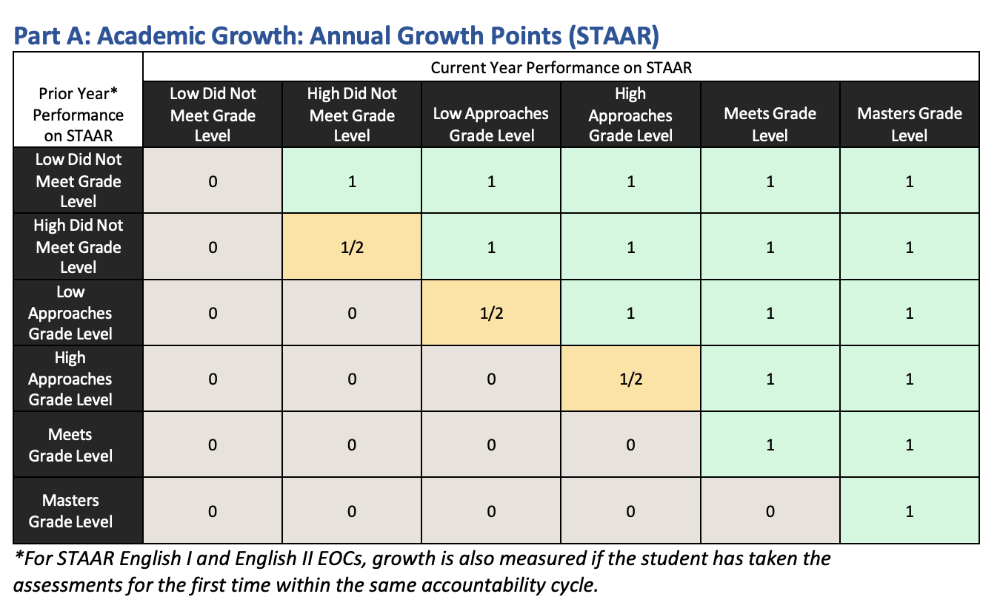

# School Progress: Academic Growth Dashboard

An interactive, high-performance dashboard for visualizing student academic growth using a TEA-style Performance Matrix. Designed for educators to track student progress across multiple assessment cycles (Previous STAAR, Fall Benchmark, Spring Benchmark).



## 🚀 Features

- **Performance Matrix**: Interactive 2D visualization of student growth based on configurable thresholds.
- **Unified Student Scores Table**: A central, interactive table featuring:
  - **3-Cycle Score View**: Simultaneous display of Previous STAAR, Fall, and Spring benchmark scores.
  - **Performance Labels**: Color-coded labels (Masters, Meets, Approaches, Does Not Meet) for instant assessment.
  - **Dynamic Interactivity**: Instant sorting, name-based filtering, and record deletion.
- **Dynamic Assessment Toggle**: Sleek UI to switch the dashboard view between Fall and Spring assessment cycles.
- **Configurable Thresholds**: Live settings panel to adjust performance cutoffs and axis labels without code changes.
- **Dark Mode Optimized**: Premium aesthetic with high-contrast visualization and glassmorphism elements.

## 🛠️ Project Structure

```text
├── dashboard/              # Next.js Frontend & API
│   ├── src/
│   │   ├── app/            # App Router & API Routes
│   │   ├── components/     # React Components (Matrix, Unified Table, etc.)
│   │   ├── lib/            # Shared Utilities (DB Connections)
│   │   └── data/           # Config JSONs (Thresholds)
├── docs/                   # Additional Documentation
└── setup_db.sql            # Database Initialization Script
```

## ⚙️ Installation

### 1. Database Setup

Ensure you have MySQL installed and running. Execute the setup script:

```bash
mysql -u your_user -p < setup_db.sql
```

### 2. Frontend Configuration

Navigate to the dashboard directory and install dependencies:

```bash
cd dashboard
npm install
```

### 3. Environment Variables

Create a `.env.local` file in the `dashboard/` directory with your database credentials:

```env
DB_HOST=127.0.0.1
DB_USER=your_user
DB_PASSWORD=your_password
DB_NAME=benchmark_matrix
```

## 🚀 Usage

To start the development server:

```bash
cd dashboard
npm run dev
```

The dashboard will be available at [http://localhost:3002](http://localhost:3002).

## 📝 License

This project is licensed under the MIT License.
